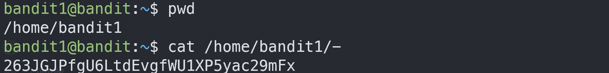

# Bandit1

## Level Goal
The password for the next level is stored in a file called readme located in the home directory. Use this password to log into bandit1 using SSH. Whenever you find a password for a level, use SSH (on port 2220) to log into that level and continue the game.

## Commands you may need to solve this level
ls , cd , cat , file , du , find

TIP: Create a file for notes and passwords on your local machine!

Passwords for levels are not saved automatically. If you do not save them yourself, you will need to start over from bandit0.

Passwords also occassionally change. It is recommended to take notes on how to solve each challenge. As levels get more challenging, detailed notes are useful to return to where you left off, reference for later problems, or help others after you’ve completed the challenge.
## 1. ssh 로 접속하기
`ssh -p 2220 bandit1@bandit.labs.overthewire.org`

`ZjLjTmM6FvvyRnrb2rfNWOZOTa6ip5If`

## 2. ls -al 
`-` 라는 파일을 볼 수 있다.

## 3. - 파일 읽기

`cat -` 를하면 `-`를 옵션으로 인식하여 해당 파일이 읽어지지 않는다.

따라서 <ins>디렉토리명을 전부 입력</ins>해주면된다.

>263JGJPfgU6LtdEvgfWU1XP5yac29mFx