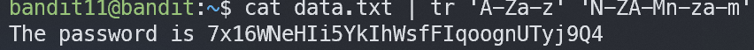

# Bandit11

## Level Goal
The password for the next level is stored in the file data.txt, where all lowercase (a-z) and uppercase (A-Z) letters have been rotated by 13 positions

## Commands you may need to solve this level
grep, sort, uniq, strings, base64, tr, tar, gzip, bzip2, xxd

## Helpful Reading Material
Rot13 on Wikipedia

## 1. ssh 로 접속하기
`ssh -p 2220 bandit11@bandit.labs.overthewire.org`

`dtR173fZKb0RRsDFSGsg2RWnpNVj3qRr`

## 2. 카이사르
1 2 3 4 5 6 7 8 9 10 11 12 13 14 15 16 17 18 19 20 21 22 23 24 25 26

a b c d e f g h i j  k  l  m  n  o  p  q  r  s  t  u  v  w  x  y  z

rot13이면 a(1) 가 n(14) 이 되는 셈이다.

### tr
`tr [대상문자] [바꿀문자]`

`tr 'A-Za-z' 'N-ZA-Mn-za-m'` 로 

A-Z -> N-Z or A-M

a-z -> n-z or a-m 으로 바꿔준다. 

> 7x16WNeHIi5YkIhWsfFIqoognUTyj9Q4
