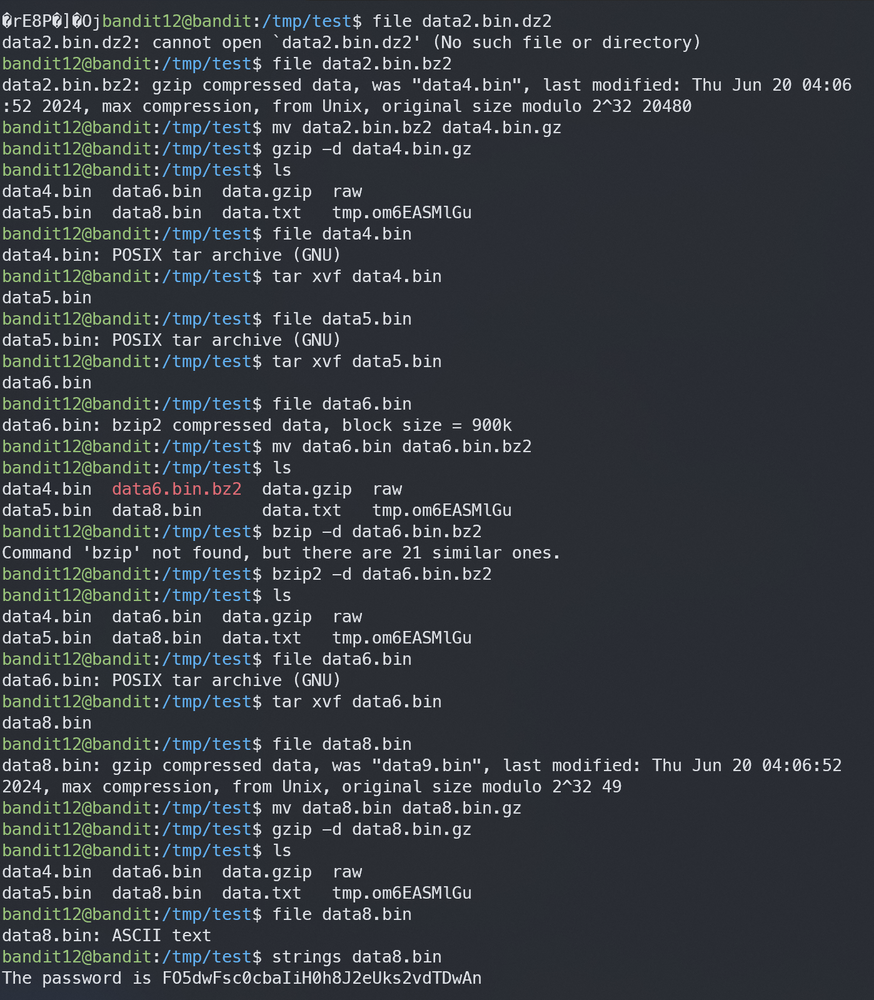

# Bandit12

## Level Goal
The password for the next level is stored in the file data.txt, which is a hexdump of a file that has been repeatedly compressed. For this level it may be useful to create a directory under /tmp in which you can work. Use mkdir with a hard to guess directory name. Or better, use the command “mktemp -d”. Then copy the datafile using cp, and rename it using mv (read the manpages!)

## Commands you may need to solve this level
grep, sort, uniq, strings, base64, tr, tar, gzip, bzip2, xxd, mkdir, cp, mv, file

## Helpful Reading Material
Hex dump on Wikipedia

## 1. ssh 로 접속하기
`ssh -p 2220 bandit12@bandit.labs.overthewire.org`

`7x16WNeHIi5YkIhWsfFIqoognUTyj9Q4`

## 2. cp /tmp/test 옮기기
`mkdir /tmp/test` 이후 `cp data.txt /tmp/test`
문제에서 그러라고함..

옮겨서 `ls`를 해보니 여러 파일들이 나타남.

## 3. 헥사덤프파일 바이너리파일로 변경
### xxd 
`xxd [파일명]` : 해당 파일을 헥사코드로 바꿈

`xxd -r [파일명]` : 헥사코드로 이루어진 파일을 원래 파일로 되돌려 줌

### file 
`file [파일명]` : 해당 파일이 어떤 파일인지 볼 수 있다.  

### gzip
`gzip [파일명].gz` : 압축
`gzip -d [파일명].gz` : 압축해제

### bzip2
`bzip2 [파일명].bz2` : 압축
`bzip2 -d [파일명].bz2` : 압축해제

### tar
`tar cvf [합친이름] 파일1, 파일2 ...` : 파일들을 하나로 합침
`tar xcf [합친이름]` : 하나로 합친 파일들을 각각의 파일로 나눔
`xxd -r data.txt > data2.txt` 로 헥사코드를 바이너리로 바꿔준다.

`file data2.txt` 로 어떤파일인지 확인해주니, gzip compressed data, was "data2.bin", last modi...... 라는 메세지가 나온다.

=> gzip 압축을 이용해 압축한 파일이란 뜻이다. (gzip으로 생성된 압축파일명은 *.gz이다.)

=> `mv data2.txt data2.bin.gz` 로 바꿔 `gzip -d data2.bin.gz`으로 압축풀어준다.

다시 file data2.bin 으로 어떤 파일인지 보면, data2.bin: bzip2 compressed data, block size = 900k 라는 메세지가 나온다.

=> bzip2 압축을 이용해 압축한 파일이란 뜻이다. (bzip2로 생성된 압축파일명은 *.bz2이다.)

=> `mv data2.bin data2.bin.bz2` 로 바꿔 `bzip2 -d data2.bin.bz2` 로 압축풀어준다.

다시 `file data2.bin` 으로 어떤 파일인지 보면, data2.bin: gzip compressed data, was "data4.bin", last modified... 라는 메세지가 나온다.

=> data4.bin 파일을 gzip으로 압축한 파일이란 뜻 `mv data2.bin data4.bin.gz` 으로 바꿔 `gzip -d data4.bin.gz` 으로 압축해제해준다.

`file data4.bin` 으로 어떤 파일인지 보면, data4.bin: POSIX tar archive (GNU) 라는 메세지가 나온다.

=> tar로 합쳐져서 만들어진 data4.bin이란뜻. `tar xvf data4.bin` 으로 풀고 또 ls 하면 똑같은 메세지로 data5가 나오니까 한번더 해준다.

아무튼 이런식으로 반복하다보면, `file data9.bin` 했을때 data9.bin : ASCII text 라는 메세지가 나오고 이걸 `cat data9.bin` 으로 읽어주면 flag가 나온다.

>FO5dwFsc0cbaIiH0h8J2eUks2vdTDwAn

