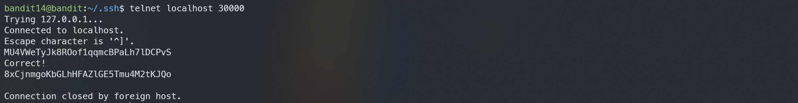
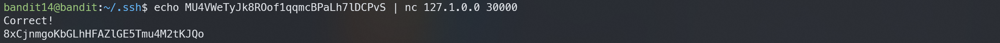

# Bandit14

## Level Goal
The password for the next level can be retrieved by submitting the password of the current level to port 30000 on localhost.

## Commands you may need to solve this level
ssh, telnet, nc, openssl, s_client, nmap

## Helpful Reading Material
How the Internet works in 5 minutes (YouTube) (Not completely accurate, but good enough for beginners)
IP Addresses
IP Address on Wikipedia
Localhost on Wikipedia
Ports
Port (computer networking) on Wikipedia

## 1. ssh 로 접속하기
`ssh -p 2220 bandit14@bandit.labs.overthewire.org`

`MU4VWeTyJk8ROof1qqmcBPaLh7lDCPvS`

## 2. nc 또는 telnet으로 localhost:30000에 메세지 보내기
`telnet localhost 30000`

`echo MU4VWeTyJk8ROof1qqmcBPaLh7lDCPvS | nc 127.1.0.0 30000`

>8xCjnmgoKbGLhHFAZlGE5Tmu4M2tKJQo

