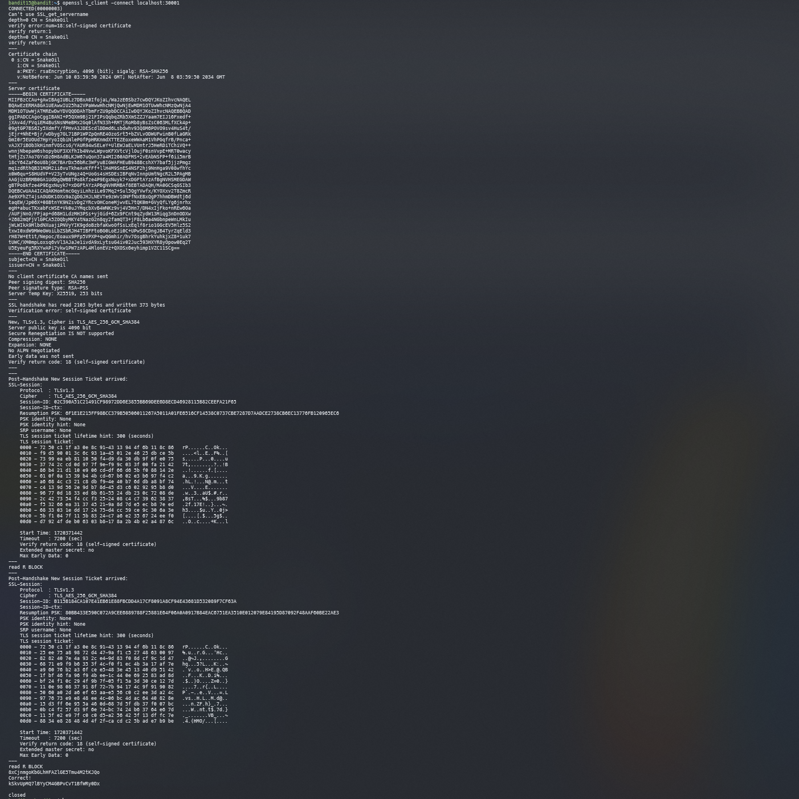

# Bandit15

## Level Goal
The password for the next level can be retrieved by submitting the password of the current level to port 30001 on localhost using SSL encryption. ssl 암호화를 사용해 localhost:30001 에 현재 레벨의 비번을 보내 키를 얻을수있다.

## Helpful note: Getting “HEARTBEATING” and “Read R BLOCK”? Use -ign_eof and read the “CONNECTED COMMANDS” section in the manpage. Next to ‘R’ and ‘Q’, the ‘B’ command also works in this version of that command…

## Commands you may need to solve this level
ssh, telnet, nc, openssl, s_client, nmap

## Helpful Reading Material
Secure Socket Layer/Transport Layer Security on Wikipedia
OpenSSL Cookbook - Testing with OpenSSL

## 1. ssh 로 접속하기
`ssh -p 2220 bandit15@bandit.labs.overthewire.org`

`8xCjnmgoKbGLhHFAZlGE5Tmu4M2tKJQo`

## 2. SSL

### OpenSSL : 보안통신을 위한 규약인 SSL을 기술적으로 구현한 라이브러리. 
- S_client : openssl 명령으로 운영되는 웹서버의 ssl 인증서 정보를 살펴보기 위해 사용되는 명령어. 
    ```
    openssl s_client -connect [서버이름]:[포트번호]
    ```
`openssl s_client -connect localhost:30001` 한다음 비밀번호를 보내주면 된다.



>kSkvUpMQ7lBYyCM4GBPvCvT1BfWRy0Dx

