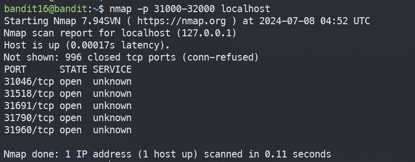
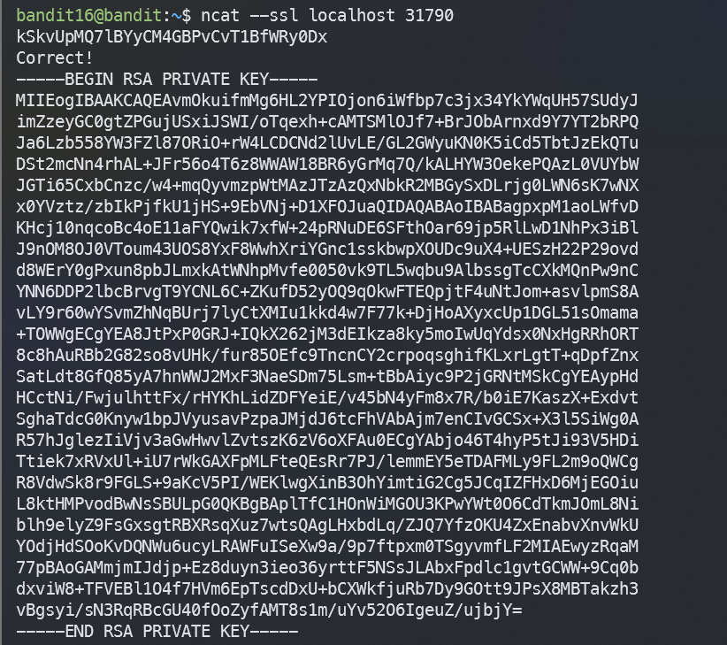
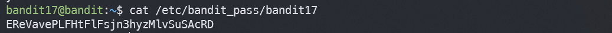

# Bandit16

## Level Goal
The credentials for the next level can be retrieved by submitting the password of the current level to a port on localhost in the range 31000 to 32000. First find out which of these ports have a server listening on them. Then find out which of those speak SSL and which don’t. There is only 1 server that will give the next credentials, the others will simply send back to you whatever you send to it.

다음 레벨의 자격은 현재 레벨의 비번을 loacalhost:31000~32000 중 하나에 보내 얻을 수 있다. 먼저, 어느 포트가 서버에 존재하는지 보고, SSL 통신이 가능한것을 찾아야한다. 

## Commands you may need to solve this level
ssh, telnet, nc, openssl, s_client, nmap

## Helpful Reading Material
Port scanner on Wikipedia
## 1. ssh 로 접속하기
`ssh -p 2220 bandit16@bandit.labs.overthewire.org`

`kSkvUpMQ7lBYyCM4GBPvCvT1BfWRy0Dx`

## 2. 서버에 존재하는 포트 찾기

### `nmap -p [포트번호] [서버이름]` : 포트번호 검색

`nmap -p 31000-32000 localhost` 로 서버의 포트들을 찾아준다.

각 포트에 대해 openssl 요청을 보내준다.

`ncat --ssl localhost 31790` 와같이 쭉 보내다보면 아래와같은 출력이 나온다.

이걸 복사해서 `/tmp/key/sshkey.private` 에 넣어주고, `ssh -i sshkey.private bandit17@localhost -p 2220` 으로 접속해주면 성공 ! 

음... 오류가 난다. band16만이 소유권이있어야한다. 따라서 `chomod 600 /tmp/key/sshkey.private` 로 권한을 바꿔주고 다시 실행해주면... bandit17로 넘어간다.

>EReVavePLFHtFlFsjn3hyzMlvSuSAcRD

