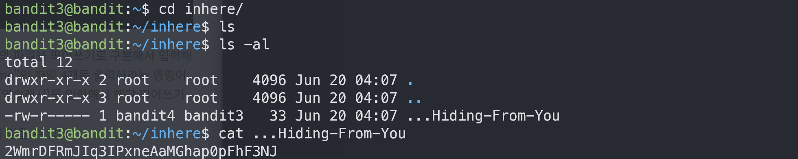

# Bandit3

## Level Goal
The password for the next level is stored in a hidden file in the inhere directory.

## Commands you may need to solve this level
ls , cd , cat , file , du , find

## 1. ssh 로 접속하기
`ssh -p 2220 bandit3@bandit.labs.overthewire.org`

`MNk8KNH3Usiio41PRUEoDFPqfxLPlSmx`

## 2. ls -al & cd inhere
`inhere/` 이라는 directory 가 있음을 알 수 있다.

`cd inhere`

`ls -al`로 보면 `...Hiding-From-You` 파일이 보인다.

## 3. 파일 읽기
`cat ...Hiding-From-You`

>2WmrDFRmJIq3IPxneAaMGhap0pFhF3NJ