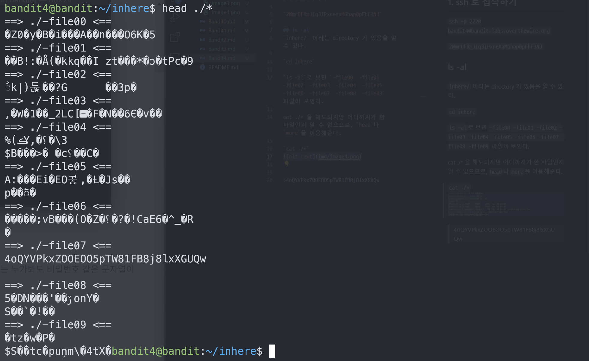

# Bandit4

## Level Goal
The password for the next level is stored in the only human-readable file in the inhere directory. Tip: if your terminal is messed up, try the “reset” command.

## Commands you may need to solve this level
ls , cd , cat , file , du , find

## 1. ssh 로 접속하기
`ssh -p 2220 bandit4@bandit.labs.overthewire.org`

`2WmrDFRmJIq3IPxneAaMGhap0pFhF3NJ`

## 2. ls -al & cd inhere
`inhere/` 이라는 directory 가 있음을 알 수 있다.

`cd inhere`

`ls -al`로 보면 `-file00  -file01  -file02  -file03  -file04  -file05  -file06  -file07  -file08  -file09` 파일이 보인다.

## 3. 여러파일 한번에 읽기
cat ./* 을 해도되지만 어디까지가 한 파일인지 알 수 없으므로, `head`나 `more`을 이용해준다.

`head ./*`

>4oQYVPkxZOOEOO5pTW81FB8j8lxXGUQw