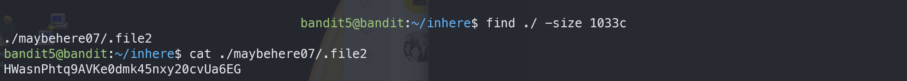

# Bandit5

## Level Goal
The password for the next level is stored in a file somewhere under the inhere directory and has all of the following properties:
```
human-readable
1033 bytes in size
not executable
```
## Commands you may need to solve this level
ls , cd , cat , file , du , find

## 1. ssh 로 접속하기
`ssh -p 2220 bandit5@bandit.labs.overthewire.org`

`4oQYVPkxZOOEOO5pTW81FB8j8lxXGUQw`

## 2. ls -al
`inhere/` 이라는 directory 가 있음을 알 수 있다.

`cd inhere`

`ls -al`로 보면 `maybehere00  maybehere03  maybehere06  maybehere09  maybehere12  maybehere15  maybehere18
maybehere01  maybehere04  maybehere07  maybehere10  maybehere13  maybehere16  maybehere19 maybehere02  maybehere05  maybehere08  maybehere11  maybehere14  maybehere17` directory들이 보인다.

하나하나 들어가 파일들을 살펴보는건 번거로운 일이다.

## 3. `find 명령어`
```bash
find [경로]
            -user 유저이름 # 해당 유저의 소유파일들 찾기
            -group 그룹이름 # 해당 그룹 권한의 파일들 찾기
            -name 파일이름 # 파일이름에 검색하고자하는 문자열이 들어있는 파일을 찾기
            -perm 권한 # 해당권한 가진 파일 출력
                #644면 해당 권한
                #+644면 6 4 4 중 하나라도 만족하는 파일
                #-644 해당권한 이상의 파일
            -size 크기 # 숫자뒤에 c붙이면 byte단위의 크기를 찾을 수 있음. +크기 -크기
```



>HWasnPhtq9AVKe0dmk45nxy20cvUa6EG