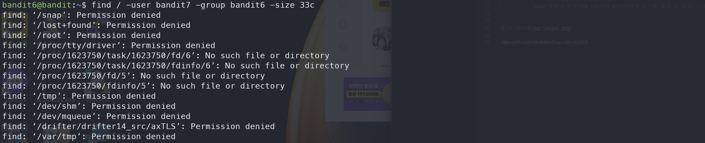

# Bandit5

## Level Goal
The password for the next level is stored somewhere on the server and has all of the following properties:
```
owned by user bandit7
owned by group bandit6
33 bytes in size
```
## Commands you may need to solve this level
ls , cd , cat , file , du , find , grep
## 1. ssh 로 접속하기
`ssh -p 2220 bandit6@bandit.labs.overthewire.org`

`HWasnPhtq9AVKe0dmk45nxy20cvUa6EG`

## 2. find 
somewhere on the server 이라하니, 경로로 `/`를 사용해준다.

`find / -user bandit7 -group bandit6 -size 33c`



허가가 없는 파일이 많이 떠서 우리가 찾는 파일을 찾기가 어렵다

## 3. 거부된 파일에 대해 출력 안하는 방법

명령어 뒤에 `2>/dev/null` 를 붙여준다.

표준에러 2를 > 로 /dev/null로 보내 버려준다. (0 표준입력 1 표준출력 2 표준에러)


>HWasnPhtq9AVKe0dmk45nxy20cvUa6EG