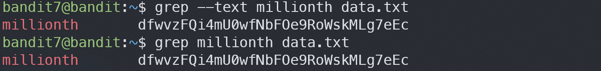

# Bandit7

## Level Goal
The password for the next level is stored in the file data.txt next to the word millionth

## Commands you may need to solve this level
man, grep, sort, uniq, strings, base64, tr, tar, gzip, bzip2, xxd

## 1. ssh 로 접속하기
`ssh -p 2220 bandit7@bandit.labs.overthewire.org`

`morbNTDkSW6jIlUc0ymOdMaLnOlFVAaj`

## 2. data.txt 에서 millionth 가있는 줄 찾기
`grep [문자열] [파일명]` or `grep --text [문자열] [파일명]`

> dfwvzFQi4mU0wfNbFOe9RoWskMLg7eEc
