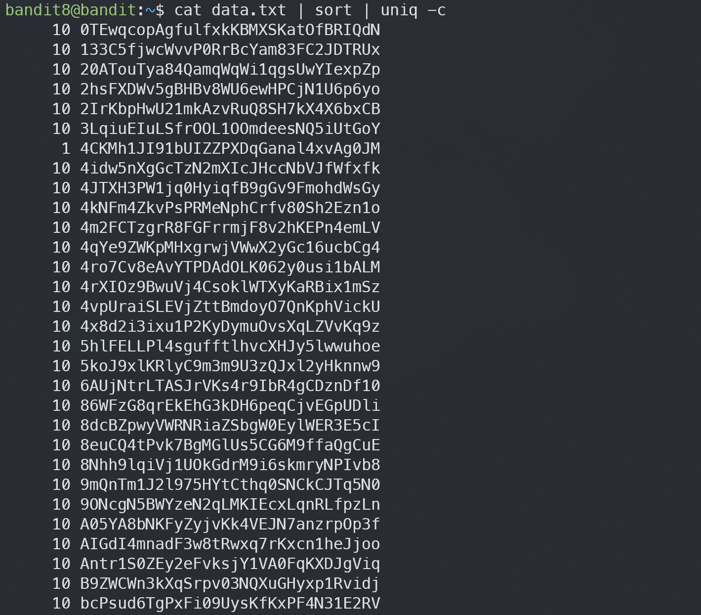

# Bandit8

## Level Goal
The password for the next level is stored in the file data.txt and is the only line of text that occurs only once

## Commands you may need to solve this level
grep, sort, uniq, strings, base64, tr, tar, gzip, bzip2, xxd

## Helpful Reading Material
Piping and Redirection

## 1. ssh 로 접속하기
`ssh -p 2220 bandit8@bandit.labs.overthewire.org`

`dfwvzFQi4mU0wfNbFOe9RoWskMLg7eEc`

## 2. data.txt 에서 한번만 출력된 줄 찾기
`cat data.txt | sort | uniq -c`

uniq는 중복을 제거해주는데, -c옵션을 넣으면 중복개수를 세준다.

> 4CKMh1JI91bUIZZPXDqGanal4xvAg0JM
